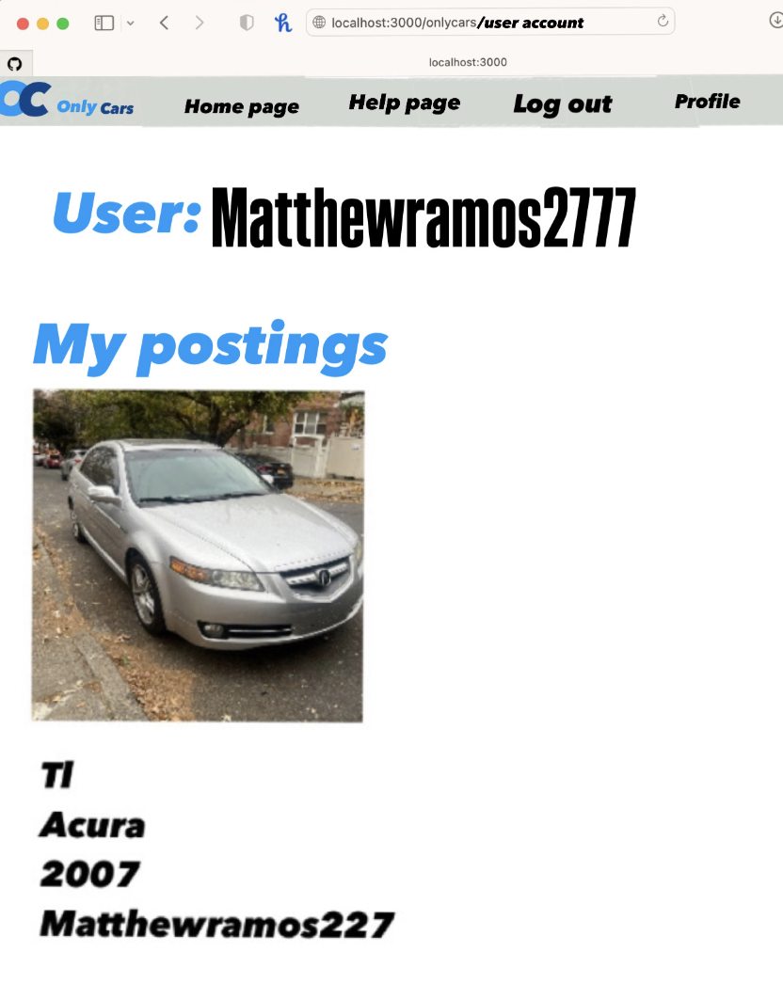
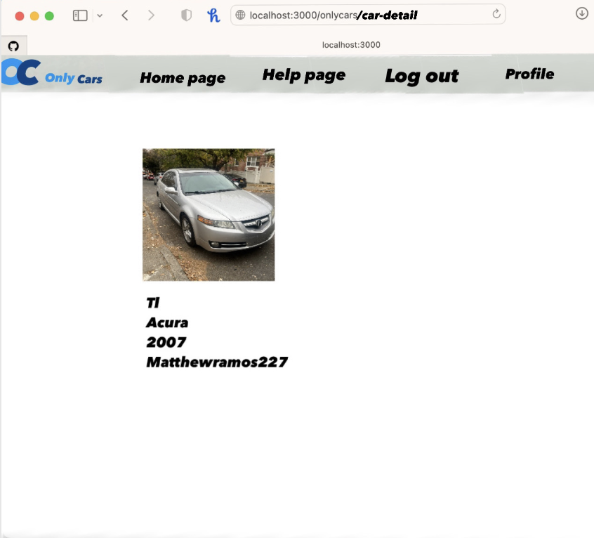
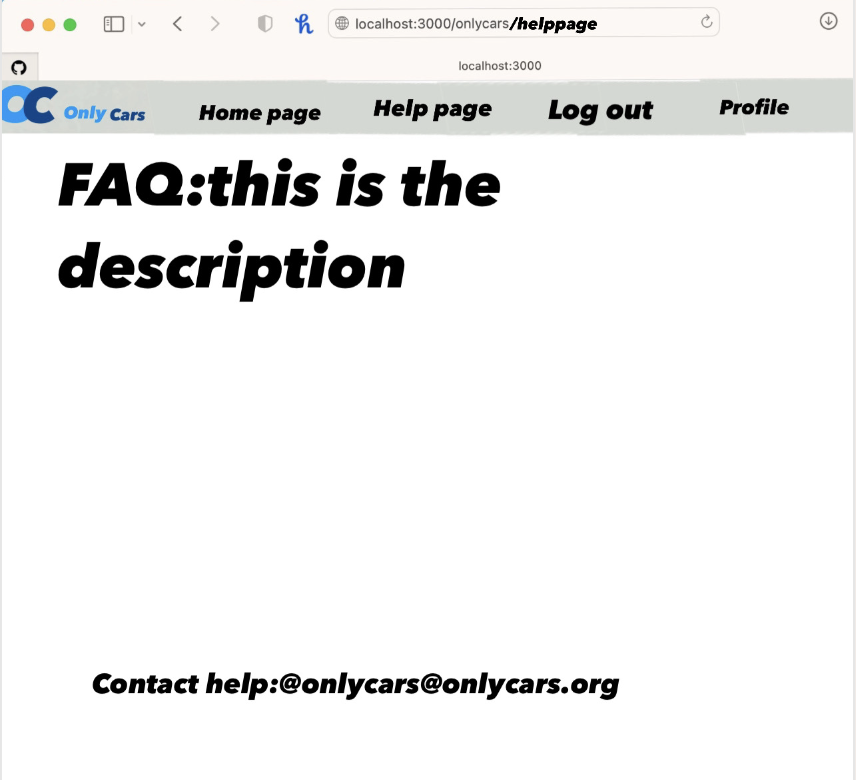
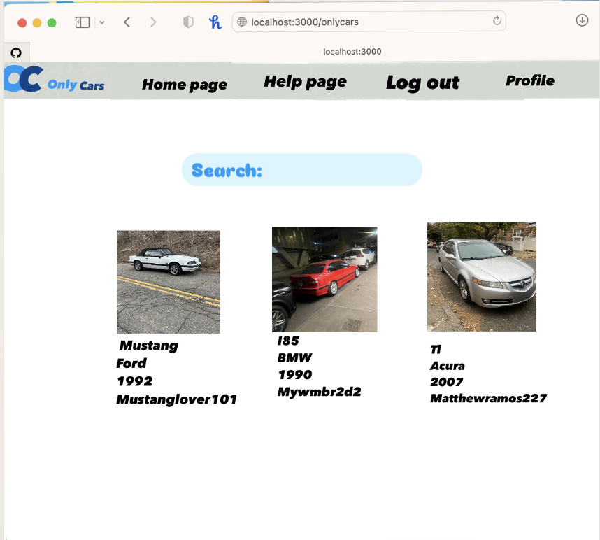

[](https://classroom.github.com/open-in-codespaces?assignment_repo_id=18986421)
The content below is an example project proposal / requirements document. Replace the text below the lines marked "**TODO**" with details specific to your project. Remove the "TODO" lines.

(**TODO**: your project name)
OnlyCars

## Overview

(**TODO**: OnlyCars is a website that you can register, show off your hot cars or hot car project and interact with the community through ratings the submsissions. Once registered, users can upload photos of their cars or ongoing car projects, allowing them to share their passion and creativity with others. The website also provides a rating system, where users can rate and review each other's cars, creating an interactive and competitive environment.Whether you're a car collector, builder, or enthusiast, OnlyCars is a space to celebrate automotive culture and connect with like-minded individuals.)

## Data Model

(**TODO**: a description of your application's data and their relationships to each other)

The application will be socail network of users cars and each other reviews

- users can have multiple lists (via references)
- each list can have multiple cars

(**TODO**: sample documents)

An Example User:

```javascript
{
  username: "abelladanger",
  hash: // a password hash,
  listsofcars : // an array of references to List documents
}
```

An Example List with Embedded Items:

```javascript
{
  user: // a reference to a User object
  name: "Breakfast foods",
  itemsofcars: [
    { carname: "acura TL", year: "2007"},
    { carname: "Volkwagen Jetta", year: "2008"},
  ],

}
```

## [Link to Commented First Draft Schema](db.mjs)

(**TODO**: create a first draft of your Schemas in db.mjs and link to it)

## Wireframes

1. Home Page (Car Listings Page)
   Elements
   Search Bar: To search for cars based on make, model, year
   Filter Options: Filters like "Car Type", "Brand", "Year", and "Location".
   Car Listings: Display car listings with a thumbnail image, car name, and brief details.
   Navigation Bar: Links to Home, search profile, Account/Profile, Help, and Logout.

2.Car Detail Page
Elements:
Car Image Gallery: A slider or grid of car images.
Car Information: Display car details like make, model, year, price, mileage, etc.
submitters profile: Button to check out the posts uploader (could be a call-to-action).
car rating: a rating on the car based on other users reviews

3.User Account/Profile Page
Elements:
Profile Information: Display user’s name,
Car postings: A list of cars the user has posted
Favorites: List of cars the user has added to their favorites.
Account Settings: Option to change email, password, and other details.
friends: a list of different users that the account follows

4.Help Page
Elements:
FAQ Section: Common questions and answers.
Contact Support Form: A form for submitting inquiries to support.

5.Sign up page /login page
(**TODO**: wireframes for all of the pages on your site; they can be as simple as photos of drawings or you can use a tool like Balsamiq, Omnigraffle, etc.)



//user account page


//posting detail page


//help page for the users


//home page for onlycars

## Site map

(**TODO**: draw out a site map that shows how pages are related to each other)
Home
├── Register
├── Login
└── Dashboard (requires login)
├── My Listings
│ ├── View All Listings
│ ├── Add New Car Listing
│ └── Edit Car Listing
├── View All Car Listings
├── Car Detail (View Listing Details)
├── My Profile
│ ├── View Profile
│ ├── Edit Profile
└── Settings
├── Change Email
├── Change Password
└── Delete Account

## User Stories or Use Cases

(**TODO**: write out how your application will be used through [user stories](http://en.wikipedia.org/wiki/User_story#Format) and / or [use cases](https://en.wikipedia.org/wiki/Use_case))

1.As a non-registered user, I can register a new account with the site.
2.As a user, I can log in to the site with my account credentials.
3.As a user, I can create a new car listing to post my car on the platform.
4.s a user, I can view all of the car listings that I have posted on my profile page.
5.As a user, I can edit details of an existing car posting ,description, and images.
6.As a user, I can delete an existing car postings from the platform.
8.As a user, I can view details of other users' car listings, including images, price, and contact information.
9.As a user, I can contact the poster of a car listing through an integrated contact form or messaging feature.

## Research Topics

(**TODO**: the research topics that you're planning on working on along with their point values... and the total points of research topics listed)

- (5 points) Integrate user authentication
  - I'm going to be using passport for user authentication
  - And account has been made for testing; I'll email you the password
    -(3 points) Mocha
    im going to be using mocha t used to write unit tests

## [Link to Initial Main Project File](app.mjs)

(**TODO**: create a skeleton Express application with a package.json, app.mjs, views folder, etc. ... and link to your initial app.mjs)

## Annotations / References Used

(**TODO**: list any tutorials/references/etc. that you've based your code off of)
